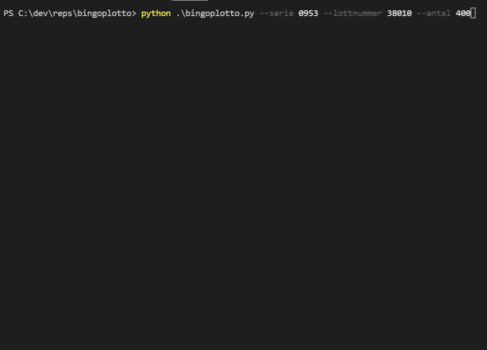

# Description
Ever wondered what the winning serie and lottnummers are? Do you want to know if the bingolott with the lottnummer after you won that million? Look no further.

# bingoplotto
Script that checks with bingolottos api for winning lottery tickets and plots them.
The script spawns 8 threads and uses requests to query bingolottos' API.
The result is stored as a {serienummer}.json with {serie+lottnummer} as keys and the win as value.



# Install
```
pip install -r requirements.txt
```

# Run
```
python bingoplotto.py --serie {serienummer} --lottnummer {lottnummer} --antal {antal}
```